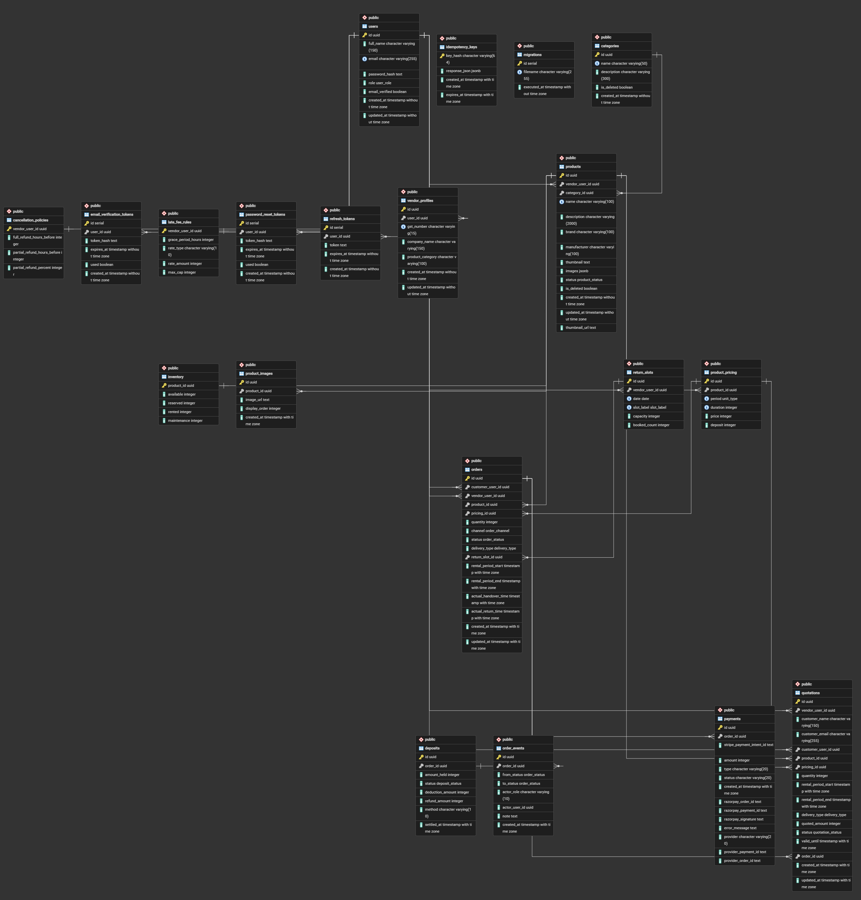

# Odoo X KSV Hackathon Project

## 🌟 Overview
Welcome to our full-stack web application developed for the **Odoo X KSV Hackathon**. This project features a modern architecture with a React-based frontend and a robust Node.js backend. 

## 🏆 Hackathon Details
- **Event:** Odoo X KSV Hackathon

## 👥 Team Members
A huge shoutout to the amazing team behind this project:
- **SMITH FALDU**
- **DHRUV MATARIYA**
- **YESHA ZADAFIYA**
- **JENIN PATEL**

## 👨‍🏫 Mentorship
We would like to express our deepest gratitude to our mentor, **Dishant Mistry (dimi)**, for his continuous support, technical guidance, and valuable mentoring throughout the course of this hackathon!

## 🔗 Demo & Resources
- **Demo Link:** [Google Drive Demo Folder](https://drive.google.com/drive/folders/18VF84FYiaFKJRxrWKX6iwLDQ0rbATn5l)

## 🏗️ Project Structure
- `/frontend`: Client-side code.
- `/backend`: Server-side code including APIs, services, and database integration.
- `docker-compose.yaml`: Containerization setup for quick deployment.

## 🚀 Getting Started

### Prerequisites
- [Node.js](https://nodejs.org/) installed
- [Docker](https://www.docker.com/) (Optional, if you prefer containerized deployment)

### Running the Application

#### 1. Using Docker (Recommended)
You can easily spin up the entire application using Docker Compose:
```bash
docker-compose up --build
```

#### 2. Manual Setup
**Backend Setup:**
```bash
cd backend
npm install
npm run dev # or npm start depending on the script setup
```

**Frontend Setup:**
```bash
cd frontend
npm install
npm run dev
```

## 🗄️ Database ER Diagram
Here is the Entity-Relationship (ER) diagram representing the database architecture of the project:



## 📸 Screenshots
Here is a glimpse into the application:


---
*Built with ❤️ during the Odoo X KSV Hackathon.*
